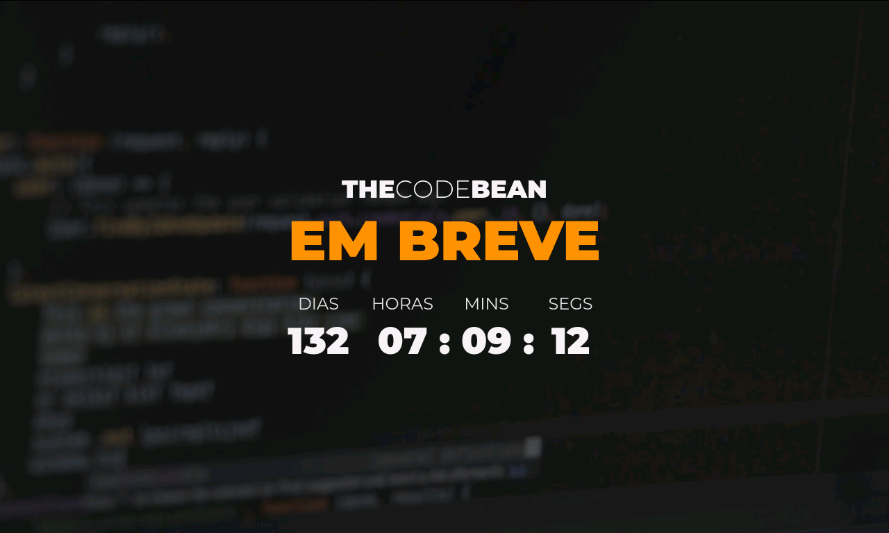

<h1 align="center">Countdown</h1>

<p align="center">
  

  

  <a href="https://github.com/joel-fragoso/countdown/commits/master">
    
  </a>

  <a href="https://github.com/joel-fragoso/countdown/blob/master/LICENSE">
    
  </a>
</p>

<hr />
<p align="center">
  <a href="#projeto">Projeto</a>&nbsp;&nbsp;|&nbsp;&nbsp;
  <a href="#tecnologias">Tecnologias</a>&nbsp;&nbsp;|&nbsp;&nbsp;
  <a href="#como-usar">Como usar</a>&nbsp;&nbsp;|&nbsp;&nbsp;
  <a href="#licença">Licença</a>
</p>
<hr />

## Projeto

O Countdown é um cronômetro regressivo desenvolvido com HTML5, CSS3, SASS e Vanilla JS.

<p align="center">
    
</p>

## Tecnologias

Este projeto foi desenvolvido com as seguintes tecnologias:

- [HTML5](https://www.w3schools.com/html/)
- [CSS3](https://www.w3schools.com/css/)
- [SASS](https://sass-lang.com/)
- [Vanilla JS](http://vanilla-js.com/)

## Como usar

Para clonar e executar esta aplicação, você vai percisar do [Git](https://git-scm.com) e do seu Browser.

### Clonando o Projeto
```bash
# Clonar deste repositório
$ git clone https://github.com/joel-fragoso/countdown.git
```

### Executando o projeto
```bash
# Entre na pasta countdown
$ cd countdown

# E clique no arquivo index.html para abri-lo no Browser
$ index.html
```

## Licença

Este projeto está sobre a licença do MIT.<br />
Clique aqui [LICENSE](LICENSE) para mais informações.

<hr />

Feito ❤️ por Joel Fragoso 👋️ [Entre em contato](https://www.linkedin.com/in/joel-fragoso-0906611a9/).
